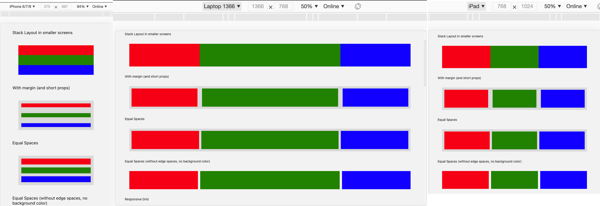
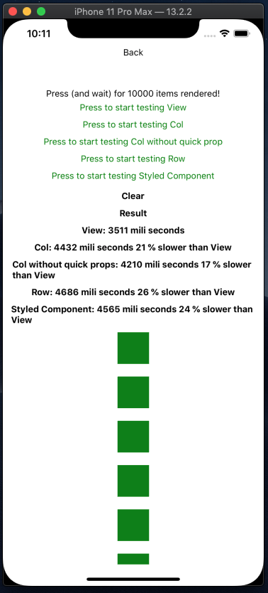

# React Quick Style Components

- Quickly style react-native (and reactjs) components via props.
- Support hover and responsive style for web and different screen sizes.
- Responsive layout handling made easy.

# Example



- [View it on Expo Snacks](https://snack.expo.io/@lequanghuylc/react-quick-style-components-example)
- [View it on Expo Project](https://expo.io/@lequanghuylc/projects/react-quick-style-components)
- [View it on CodeSandbox](https://codesandbox.io/s/react-quick-style-components-1zons)


# Contents

- [Installation](#installation)
- [Main Idea](#main-idea)
- [Performance Concern](#performance-concern)
- [Best Practice](#best-practice)
- [Usage](#usage)
- [Styled Props](#styled-props)
- [Style Hooks](#style-hooks)
- [Responsive Styled Props](#responsive-styled-props)
- [Col Component](#col-component)
- [Row Component & Responsive layout](#row-component)
- [Text Component](#text-component)
- [Advanced usage](#advanced-usage)
- [UI Builder Support](#ui-builder-support)

# Installation

## React Native
```
yarn add react-quick-style-components
```

No linking required

## React JS

Assuming you use `create-react-app` or `expo web`:

```
yarn add react-native-web react-quick-style-components
```

# Main Idea

We usually style our component like this (inline or StyleSheet)

```
{
  width: 50,
  height: 50,
  margin: 10,
  backgroundColor: 'green',
  justifyContent: 'center',
  alignItems: 'center',
}
```

What if we can have a really quick way of styling by using prop. Like:

```
<Col
  width={50}
  height={50}
  margin={10}
  backgroundColor="green"
  justifyContent="center"
  alignItems="center"
/>
```

And with the advantage of boolean prop, we could get it even quicker (in terms of Coding convenience), like:

```
<Col
  width50
  height50
  margin10
  backgroundColor="green"
  middle // common global styleset, equal { justifyContent: 'center', alignItems: 'center'  }
/>
```

# Performance Concern

- In the speed test, we compared it with normal `View` component, and `styled-components`. The test code is really simple, PR is welcome.



# Best Practice

1. If you have more than 3 styled props, put it in StyleSheet. Too many styled props will not be convenient anymore.
2. Create your own common style objects to avoid repeating your self
3. Organize the components and keep them small and simple

## Usage

### Initial setup

```
import { StyleSheet } from 'react-native';
import { initQuickStyle, Text } from 'react-quick-style-components';
import { FONT, COLOR } from './some-where/in/your/project'

// Use for quick prop like: colorMain, bgMain.

initQuickStyle.setMainColor(COLOR.MAIN);

// Use for default text style

Text.setFontStyle({
  fontFamily: 'NunitoSans_400Regular',
  color: '#CCCCCC',
});

// Use for quick style, e.g: if you pass Style.create({ white: { color: 'white' } }). You will be able to use <Text white>Hello World!</Text>

const additionStyles = StyleSheet.create({
  shadow: {
    shadowColor: "#000",
    shadowOffset: {
      width: 0,
      height: 1,
    },
    shadowOpacity: 0.20,
    shadowRadius: 1.41,
    elevation: 2,
  },
});

initQuickStyle.setAdditionStyles(additionStyles);
```

### Usage

#### Text

```
  import { Text } from 'react-quick-style-components';

  const App = () => (
    <Text colorMain bold fontSize20>Hello World!</Text>
  )
```

#### Col

```
  import { Col } from 'react-quick-style-components';

  const handlePress = () => alert('Hello World!');

  const App = () => (
    <Col flex1 bgMain onPress={handlePress}></Col>
  )
```

#### Row

```
  import { Col } from 'react-quick-style-components';

  const handlePress = () => alert('Hello World!');

  const App = () => (
    <Row flex1 bgMain onPress={handlePress}></Row>
  )
```

# Styled Props

- Pretty much all the styled properties (take a look at `./utils/globalProps.ts` line 22)
- Auto split number value from Boolean props

```
<Col
  width100
  zIndex1
  flex1
/>
```

Equal to
```
<Col
  width={100}
  zIndex={1}
  flex={1}
/>
```
- Common style sets (take a look at `./utils/commonStyle.ts`)

| Prop | Description |
|---|---|
|**`middle`**|Align items center (vertically and horizontally)|
|**`flex1`**|Flex 1|
|**`absolute`**|Position absolute|
|**`absoluteFill`**|Position absolute and full parent width, height|
|**`bgWhite`**|White background|
|**`colorWhite`**|White color text|
|**`colorMain`**|Main color text, (after run `initQuickStyle.setMainColor`)|
|**`bgMain`**|Main background color, (after run `initQuickStyle.setMainColor`)|
|**`bold`**|bold fontweight text|
|**`width100p`**|width 100%|
|**`height100p`**|height 100%|
|**`overflowH`**|overflow hidden|

# Style Hooks

`Style Hooks` is in easy way to transform value of `styled props`. For example when you want to normalize your font size

```js
initQuickStyle.setStyleHooks({
  fontSize: (value) => {
    return normalize(value)
  },
});
```

After that, all of your `<Text fontSize={xyz} />` will go thourgh that function and converted to a new value.

# Responsive Styled Props

Components `Col`, `Row`, `Text`, `Img`, `Scroll`, `Input` all come with responsive style support via prop `onResponsiveStyle`. 

```jsx
<Col
  width100
  height100
  backgroundColor="black"
  onResponsiveStyle={{
    md: {
      width: 200,
      height: 200,
    },
    lg: {
      backgroundColor: 'pink',
    }
  }}

/>

```


# Col Component

- Flex direction `column`
- If `onPress` prop is given, it will operate like a `TouchableOpacity` (activeOpacity `0.9`)
- `onHoverStyle`: it's a web prop: Pass a object style here and it will apply when user hover over the component.
- `useHoverNativeProps`: apply the hover style without rerendering the component. credit to the guys here https://github.com/necolas/react-native-web/issues/205 , let me know if you have trouble using this prop

Example: 
```jsx
<Col
  middle
  style={styles.previewBox}
  useHoverNativeProps
  onHoverStyle={{ borderColor: COLOR.MAIN, borderWidth: 1, borderRadius: 4 }}
>
  {child}
</Col>
```

# Row Component

- `onPress` work exactly like `Col`, infact it's `Col` under the hood, so every props of `Col` can be used here.
- Flex direction `row`
- Align items `center` by default. If `stretch` props is specific (`true`), the children will have 100% height
- This component has responsive settings.

```typescript
export interface Props {
  onRef?(): void,
  stretch?: boolean,
  responsiveLayout?: {
    sm?: string,
    md?: string,
    lg?: string,
    xl?: string,
    xxl?: string,
    xxxl?: string,
    [breakpoint: string]: string,
  },
  [key: string]: any,
}
```

For example

```jsx
<Row responsiveLayout={{ xs: '100%', sm: '1:1:2', md: '1:2:1' }}>
  <Col width100p height100>
    <Col margin10 flex1 backgroundColor="black" />
  </Col>
  <Col width100p height100>
    <Col margin10 flex1 backgroundColor="red" />
  </Col>
  <Col width100p height100>
    <Col margin10 flex1 backgroundColor="pink" />
  </Col>
</Row>
```


- width breakpoints follow Bootstrap CSS Web framework `xs`, `sm`, `md`, `lg` and `xl`
- `<Row responsive={{ md: '1:.' }} />`
  - every child will have flex 1 in md breakpoint

- `<Row responsive={{ md: '1:2' }} />`
  - only render two first child, with flex 1 and flex 2 in md breakpoint

- `<Row responsive={{ md: '1:2', sm: '100%' }} />`
  - same with the above, and in sm breakpoint all will have 100% width, and flex wrap style

# Text Component

- define default font family and color with `Text.setFontStyle`
```jsx
import { Text, Col } from 'react-quick-style-components';

Text.setFontStyle({
  fontFamily: 'NunitoSans_400Regular',
  color: '#CCCCCC',
});
```

If you use `@expo-google-fonts`, there will be a lot of font weights as seperate fonts. We can use `setAdditionStyles` to quickly assign font:

```jsx
initQuickStyle.setAdditionStyles({
  light: {
    fontFamily: 'NunitoSans_300Light'
  },
  semiBold: {
    fontFamily: 'NunitoSans_600SemiBold'
  },
  bold: {
    fontFamily: 'NunitoSans_700Bold'
  },
});
```

Example `<Text light />`

# Advanced Usage

With the help of `react-native-web`, we can use this library on both web and mobile app. Soon we will want to *write once, run anywhere*. But truly cross-platform is hard to achieve. While some UIs can look the same, some layouts can be responsive, there are still many things to cover like navigation, flow, user behaviour. If you use too many ifs for platform check, and the structrure of web and mobile app are different, then it's not *write once* anymore. It's just *write in the same place*

In attempt to make cross-platform coding more convenient, this library introduce some concept like `Banks - Allocation pattern`, `Header Navigation`. Read more about it [here](banks-allocation-pattern.md).

# UI Builder Support

For now it supports render UI from json. The roadmap for this part is to build a UI Builder to around that json parser. Check example in the link at the begining of this readme.

```jsx
import { Parser } from 'react-quick-style-components';

<Parser
  {...({
    id: 'Heading',
    from: 'Text',
    style: {
      fontSize: 25,
    },
    props: {
      text: 'Render react component from JSON'
    }
  })}
/>
```